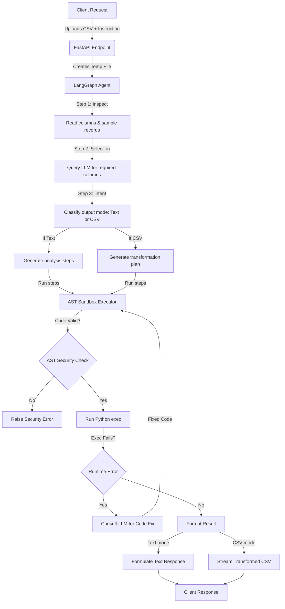

# Agentic Data Analyst

An enterprise-grade, secure, and production-ready FastAPI service orchestrating LangGraph data analysis agents. This application ingests CSV datasets and resolves complex, natural language data queries by dynamically planning, validating, self-correcting, and executing Python/pandas code steps in a restricted AST-validated sandbox.

---

## Key Features

- **LangGraph Orchestration**: Uses a structured state machine to pipeline dataset inspection, AI-driven column selection, intent identification, and code generation.
- **AST-Based Code Sandboxing**: Prevents arbitrary code execution by verifying generated code steps using Python's Abstract Syntax Tree (`ast` module) and checking for forbidden builtins, imports, and system libraries.
- **RESTful FastAPI Service**: Fully refactored API layer structured with modular routing, standard Pydantic models, and strict type annotations.
- **LLM-Guided Self-Correction**: Implements automated runtime correction loops. If a generated pandas step fails, the agent automatically consults the LLM with traceback details to safely refactor and retry the execution.
- **Enterprise Logging & Error Handling**: Configured with Python's standard logging library to log execution states cleanly and securely while masking sensitive tracebacks from client responses.
- **Containerized & Production-Ready**: Features a multi-stage, non-root `Dockerfile` and developer-friendly `docker-compose.yml` configurations.
- **Comprehensive Test Suite**: Automated verification covering code execution safety, Pydantic settings parsing, and FastAPI route responses via mock-wrapped integrations.

---

## System Architecture

The following diagram illustrates the flow of a file processing request through the application:



---

## Directory Structure

```
g:/Agentic_Data_Analyst/
├── app/                        # Core Application Code
│   ├── main.py                 # FastAPI Application Orchestration
│   ├── config.py               # Pydantic Settings
│   ├── routes/                 # Route Routers
│   │   └── analysis.py         # Endpoints (/processing, /health)
│   ├── services/               # Core Services
│   │   ├── agent.py            # LangGraph State & Workflow nodes
│   │   └── executor.py         # Sandbox Pandas Exec Engine
│   ├── schemas/                # Request/Response Data Validation
│   │   └── analysis.py         # Pydantic Schemas
│   └── utils/                  # Helper Utilities
│       ├── security.py         # AST Validator & Lexical Checks
│       └── logging_config.py   # System-wide Logging Config
├── tests/                      # Automated Test Suite
│   ├── test_security.py        # Sandbox AST Security Tests
│   ├── test_executor.py        # Sandbox execution unit tests
│   └── test_api.py             # Route Integration Tests
├── .env.example                # Env Variable Template
├── Dockerfile                  # Multi-stage Containerization
├── docker-compose.yml          # Dev Container Setup
├── pyproject.toml              # Pytest/Lint Config
└── requirements.txt            # System Dependencies
```

---

## Security Sandbox Implementation

Executing LLM-generated code presents severe security risks (such as remote code execution or data breaches). To mitigate this, this project implements a **Defense-In-Depth Security Sandbox**:

### 1. Lexical Substring Checks
Before parsing, raw code strings are scanned for blacklisted patterns (`import`, `subprocess`, `os.`, `sys.`, `__`, etc.) to intercept obvious exploit payloads.

### 2. AST (Abstract Syntax Tree) Verification
Code is parsed into an AST without execution. A custom visitor node parses the syntax tree:
- **Disallows imports**: Absolutely blocks `Import` and `ImportFrom` nodes.
- **Blocks structure creation**: Rejects user-defined class (`ClassDef`) or function (`FunctionDef`) declarations to keep execution scopes flat and predictable.
- **Forbids System Access**: Rejects access to sensitive modules (`os`, `sys`, `subprocess`, `shutil`, `socket`) or hazardous builtins (`open`, `eval`, `exec`, `__import__`, `globals`).
- **Blocks Dunder Attributes**: Intercepts accesses to properties starting with `__` (e.g. `__class__`, `__globals__`, `__dict__`) to prevent sandbox escapes.

### 3. Namespace Isolation
Code runs using a restricted global dictionary:
- Sets `__builtins__` to empty `{}`.
- Grants explicit access only to harmless utilities (e.g., `pd`, `np`, `abs`, `round`, `sum`, `len`, `int`, `str`, `list`).

---

## Getting Started

### Prerequisites
- Python 3.10+
- OpenAI API Key

### Local Installation
1. Clone the repository.
2. Create and activate a virtual environment:
   ```bash
   python -m venv .venv
   source .venv/bin/activate  # On Windows: .venv\Scripts\activate
   ```
3. Install dependencies:
   ```bash
   pip install -r requirements.txt
   ```
4. Configure environment files:
   ```bash
   cp .env.example .env
   # Edit .env and insert your actual OPENAI_API_KEY
   ```
5. Run the server:
   ```bash
   python main.py
   ```
   The API will be available at `http://localhost:8000`.

### Running in Docker
To spin up the application in a docker container:
```bash
docker-compose up --build
```

---

## Running Tests

Automated testing is configured via `pytest`. Run the full test suite using:
```bash
pytest -v
```

---

## API Reference

### Health Check
- **Endpoint**: `GET /health` (or `GET /` for backwards compatibility)
- **Response**:
  ```json
  {
    "status": "healthy",
    "message": "API is healthy",
    "environment": "production"
  }
  ```

### Process Dataset
- **Endpoint**: `POST /processing`
- **Content-Type**: `multipart/form-data`
- **Request Parameters**:
  - `file`: CSV file attachment (multipart)
  - `instruction`: Search query or transformation instruction (string)
- **Response**:
  - If request mode is `text`: Returns a JSON string containing the textual answer (e.g. `"The average age of employees is 32.5 years."`).
  - If request mode is `csv`: Returns a downloadable file attachment containing the transformed dataset (e.g. `transformed_dataset.csv`).
